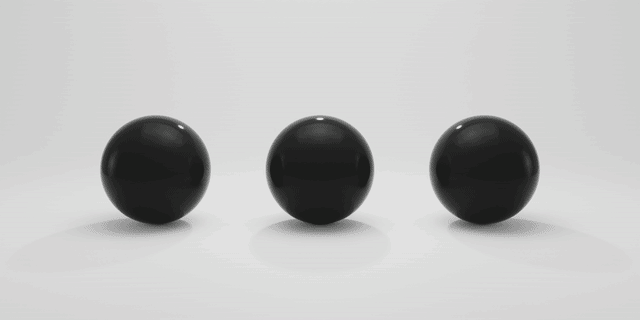
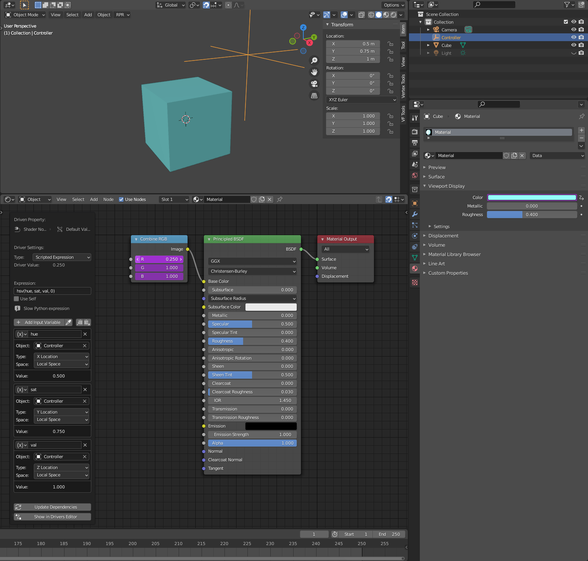
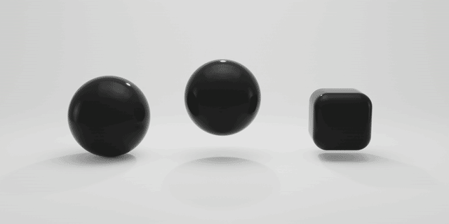

# VF Driver Functions
Functions for use in Blender channel drivers.


## Installation and usage:
- Download the desired driver
	- [VF_curveAtTime.py](https://raw.githubusercontent.com/jeinselenVF/VF-BlenderDriverFunctions/main/VF_curveAtTime.py)
	- [VF_hsv.py](https://raw.githubusercontent.com/jeinselenVF/VF-BlenderDriverFunctions/main/VF_hsv.py)
	- [VF_wiggle.py](https://raw.githubusercontent.com/jeinselenVF/VF-BlenderDriverFunctions/main/VF_wiggle.py)
- Open up Blender Preferences > Add-ons
- Install and enable the add-on
- Add a driver to any channel via keyboard shortcut (usually "D"), context menu (right-click), or directly (typing "#" and then the function)


## curveAtTime
This driver function is intended to mimic Adobe After Effect's "valueAtTime" expression, returning the value of an animated channel from the specified point in time.

After Effects expression reference:
```javascript
thisComp.layer("Cube").transform.position.valueAtTime(time-0.167)[0]
```
This returns the value of the "Cube" layer's X position from 0.167 seconds in the past, relative to the current time.

Blender driver equivalent:
```javascript
curveAtTime("Cube", 0, frame-5)
```
This returns the value of the "Cube" object's first animation curve from 5 frames in the past, relative to the current frame.

Note that Blender's time sampling doesn't allow references to an object's transform property; it has to be an animation curve, and it can only be referenced by index. The first channel that is keyframed will be assigned index 0, the second channel to be animated will be index 1, and so on.

### curveAtTime examples



1. The left sphere is named "Sphere" and has an animation curve applied to the Z position channel
2. The middle sphere has the following driver applied to the Z position channel: `curveAtTime("Sphere", 0, frame-5)`
  - Note how the time offset is implemented in frames, not fractions of a second like in AE
3. The right sphere has the following driver applied to the Z position channel: `curveAtTime("Sphere", 0, frame*0.5-5)`
  - Note how the current frame value is multiplied by 0.5 to slow down time


## hsv
Converts from HSV value inputs to RGB value outputs. Because drivers are designed for individual channel usage, the specific red (`0`), green (`1`), or blue (`2`) channel output must be selected.

The following example uses the `X`, `Y`, and `Z` positions of a controller null to drive the `hue`, `sat`, and `val` variables within the driver, and the same driver setup is copied across all three `r`, `g`, and `b` input channels in both the material, updating the fourth value (`0`, `1`, or `2`) to match the channel index.

```javascript
hsv(hue, sat, val, 0)
```

Download the example project: [hsv.blend](images/hsv.blend.zip)



## wiggle
Designed to mimic Adobe After Effect's "wiggle" expression with similar frequency (colloquially known as wiggles per second) and octave settings.

After Effects expression reference:
```javascript
seedRandom(4, true);
wiggle(3, 200, 1)
```
This automatically animates a channel using a static seed of 4 with about 3 "wiggles" per second, a potential distance range of -200 to 200 pixels, and 1 octave of noise.

Blender driver equivalent:
```javascript
wiggle(3, 0.2, 1, 4)
```
This automatically animates a channel and vaguely matches AE's 3 "wiggles" per second, a potential distance range of -200mm to 200mm (if used in a transform channel), with 1 octave of noise, and a random seed of 4 (seeds can be any floating point number, including negative numbers).

Note that unlike After Effects, driver functions in Blender don't automatically receive unique identifiers for each channel they are applied to, so a unique seed value must be provided by the user.

### wiggle examples



1. The left sphere has the following drivers applied to the Z position and all three scale channels:
  - Z:  `wiggle(2, 0.125, 3, 4.5) + 0.5`
  - Scale:  `wiggle(2, 0.25, 3, 4.5) + 1.0`
2. The middle sphere has the following drivers applied to the X, Y, and Z position channels:
  - X: `wiggle(1, .45, 1, 0.5)`
  - Y: `wiggle(2, .35, 1, 1.5)` 
  - Z: `wiggle(1, .25, 1, 2.5) + 0.75`
3. The right cube has the following drivers applied to the Z. Y, and Z rotation channels:
  - X: `round(wiggle(0.3, 7.0, 3, 100)) / 7.0 * pi`
  - Y: `round(wiggle(0.3, 7.0, 3, 200)) / 7.0 * pi`
  - Z: `round(wiggle(0.3, 7.0, 3, 200)) / 7.0 * pi`
